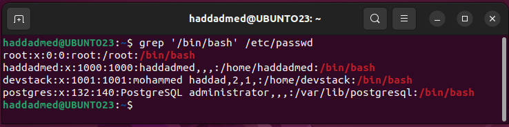

# Exercie 1 Day 2

By HADDAD MOHAMMED

### **1. What Are Regular Expressions?**

- **Patterns** used to search/match text (e.g., in `sed`, `awk`, `grep`).
- Combine **literal characters** (e.g., `a`, `@`) and **metacharacters** (e.g., `^`, `$`, `+`).

---

### **2. Key Metacharacters**

| **Character** | **Meaning** | **Example** |
| --- | --- | --- |
| `^` | Start of line | `^Hello` → Lines starting with "Hello" |
| `$` | End of line | `world$` → Lines ending with "world" |
| `.` | Any single character (except newline) | `h.llo` → "hello", "hallo" |
| `*` | Zero or more of the previous | `lo*` → "l", "lo", "loo" |
| `+` | One or more of the previous | `lo+` → "lo", "loo" |
| `[]` | Character set (any one inside) | `[aeiou]` → Matches vowels |
| `{}` | Exact quantity or range | `a{2,4}` → "aa", "aaa" |
| `()` | Grouping | `(abc)+` → "abc", "abcabc" |
| `\` | Escape special characters | `\.` → Literal dot (.) |

---

### **3. BRE vs. ERE (POSIX Standards)**

- **BRE (Basic)**: Simpler, requires escaping for `+`, `?`, `|` (e.g., `\+`).
    - Used by default in `sed`, `grep`.
- **ERE (Extended)**: Supports `+`, `?`, `|` without escaping.
    - Used in `awk`, `grep -E`, `sed -E`.

Checking email adresse 

test_test@test.tes.test

/ ^([A-Za-z0-9_\-\.]+)@ ( [A-Za-z0-9_\-]+)\.([A-Za-z]\.{2,5})$/

# grep , awk and sed

The grep = ( **g**lobal **r**egular **e**xpression **p**rint)

grep copies a line into a
buffer, compares it against the search string, and if the comparison passes, prints the line to the
screen. Grep will repeat this process until the file runs out of lines.

grep "boo" a_file
-n     for listting with numbers

-v      print the negative comparison

-c      calcualte the number of occurence  

  

# Options Available in grep Command

| **Options** | **Description** |
| --- | --- |
| **-c** | This prints only a count of the lines that match a pattern |
| **-h** | Display the matched lines, but do not display the filenames. |
| **–i** | Ignores, case for matching |
| **-l** | Displays list of a filenames only. |
| **-n** | Display the matched lines and their line numbers. |
| **-v** | This prints out all the lines that do not matches the pattern |
| **-e exp** | Specifies expression with this option. Can use multiple times. |
| **-f file** | Takes patterns from file, one per line. |
| **-E** | Treats pattern as an extended regular expression (ERE) |
| **-w** | Match whole word |
| **-o** | Print only the matched parts of a matching line, with each such part on a separate output line. |
| **-A n** | Prints searched line and nlines after the result. |
| **-B n** | Prints searched line and n line before the result. |
| **-C n** | Prints searched line and n lines after before the result. |

## WC command

Wc Command to Count Number of Lines, Words, and Characters in File

**wc** (short for **word count**) is a command line tool in Unix/Linux operating systems, which is used to find out the number of newline count, word count, byte and character count in the files specified by the ***File*** arguments to the standard output and hold a total count for all named files.

The followings are the options and usage provided by the **wc** command.

- **`wc -l`** – Prints the number of lines in a file.
- **`wc -w`** – prints the number of words in a file.
- **`wc -c`** – Displays the count of bytes in a file.
- **`wc -m`** – prints the count of characters from a file.
- **`wc -L`** – prints only the length of the longest line in a file

## ****

| **Request** | 1. Display a list of all the users on your system who log in with the Bash shell as a default.
2. From the `/etc/group` directory, display all lines starting with the string "daemon".
3. Print all the lines from the same file that don't contain the string.
4. Display localhost information from the `/etc/hosts` file, display the line number(s) matching the search string and count the number of occurrences of the string.
5. Display a list of `/usr/share/doc` subdirectories containing information about shells.
6. How many `README` files do these subdirectories contain? Don't count anything in the form of "README.a_string".
7. Make a list of files in your home directory that were changed less that 10 hours ago, using **grep**, but leave out directories.
8. Can you find an alternative for **wc** `-l`, using **grep**?
9. Using the file system table (`/etc/fstab` for instance), list local disk devices.
10. Display configuration files in `/etc` that contain numbers in their names.
11. At least two games from [regex cross word](https://regexcrossword.com/) |
| --- | --- |

```bash
##Display a list of all the users on your system who
	## log in with the Bash shell as a default.
grep '/bin/bash' /etc/passwd
```



```bash
##From the /etc/group directory, display all lines starting with the string "daemon".

grep -r -E '^daemon' /etc/group
```


```bash
##Print all the lines from the same file that 
	#don't contain the string.(asumming 'daemon'!)
	
grep -r -E -v '^daemon' /etc/group
```


```bash
## Display localhost information from the /etc/hosts file, 
	## display the line number(s) matching the search string and count.
		# the number of occurrences of the string
grep -n -c 'localhost' /etc/hosts
```


```bash
##Display a list of /usr/share/doc subdirectories 
	# containing information about shells.
find  /usr/share/doc -type d -iname '*shell*'
```


10. Display configuration files in `/etc` that contain numbers in their names.

tryed to solve it manualy but couldn’t i’ll back to it later :

```bash
##How many README files do these subdirectories contain? 
	# Don't count anything in the form of "README.a_string".
find  /usr/share/doc -type d -iname '*shell*' | grep -r -F -f 'README' (wrong)

```

this not possible to acheave using the grep command only lets try combinit using the ls 

```bash
##Make a list of files in your home directory that were 
	#changed less that 10 hours ago, using **grep**, but leave out directories.
	
ls -lt  (ill back to it later )
```

 Can you find an alternative for **wc** `-l`, using **grep**?

Yes as mentioned earlier the grep command have the option of -c that calculate the numbre lines

so using 

```bash
	
grep -c . FILENAME
```

we are achieving the same functionality of 

```bash
	
 **wc** -l FILENAME
```

9.Using the file system table (`/etc/fstab` for instance), list local disk devices.

Well we need firts to understand the format that we are going  to check using grep and regex 

our goal to list all files that have the  same structur as :`/dev/sdX` or `/dev/hdX`  HDD and SSD

using Regex : 

My first try was

‘^/dev/hd[a-z0-9]+$ | ^/dev/sd[a-z0-9]+$’ 

then searched for optimized solution its was obvious but didnt see it :(

‘^/dev/[hd]d[a-z0-9]+$ ’ 

```bash
	
grep -E '^/dev/[hs]d[a-z0-9]+$' /etc/fstab
```

10. Display configuration files in `/etc` that contain numbers in their names.
its easy just by combining the ls output with grep command 

```bash
	
ls /etc | grep '[0-9]'
```