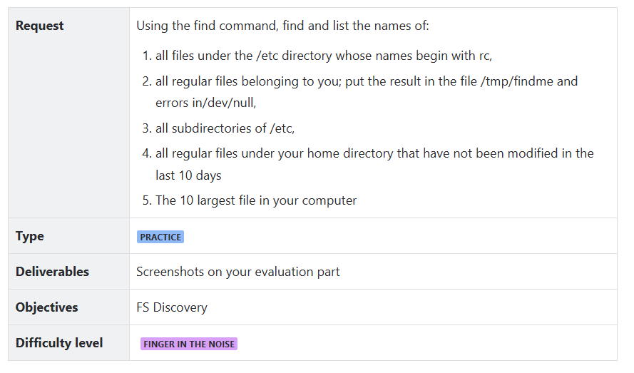

# Exercice 2 Day 1

By Haddad Mohammed

The *Find* Command  (seraching and lacating files)

find [starting_directory] [expression]

find [starting_directory] [expression]

```bash
find [starting_directory] [expression]
#Example
find /home/user -name "*.txt"
```

-name

-type (specify the file Type)

-mtime (Search by modification time)

-size +(size)

-user

# **Other supported parameters**

- `-name`: Case-insensitive search by file name
- `-regex`: Search using regular expressions
- `-exec`: Execute a command on each found file
- `-group`: Search by file-group
- `-perm`: Search by file permissions

# **Most common use cases**

These are some of the most common use cases for the `find` command:

```
# Find files modified within the last 7 days
find /home/user -type f -mtime -7

# Find files larger than a specific size
find /home/user -type f -size +1M
```

| **Request** | Using the find command, find and list the names of:
1. all files under the /etc directory whose names begin with rc,
2. all regular files belonging to you; put the result in the file /tmp/findme and errors in/dev/null,
3. all subdirectories of /etc,
4. all regular files under your home directory that have not been modified in the last 10 days
5. The 10 largest file in your computer |
| --- | --- |

How to make the output of a commande writed in a file 

To just redirect the output to a file : 

```
SomeCommand > SomeFile.txt

```

Or if you want to append data:

```
SomeCommand >> SomeFile.txt
```

**Standard error (stderr)**[[edit](https://en.wikipedia.org/w/index.php?title=Standard_streams&action=edit&section=5)]

Standard error is another output stream typically used by programs to output [error messages](https://en.wikipedia.org/wiki/Error_message) or diagnostics. It is a stream independent of standard output and can be redirected separately.

how to use it as output in a file 

&> redirect both stdout and stderr 

2> redidirect only error stderr 

```
SomeCommand &> SomeFile.txt
SomeCommand 2> SomeFile.txt
```

or this to append:

```
SomeCommand &>> SomeFile.txt
SomeCommand 2>> SomeFile.txt
```

### Options Available in Sort Command

| **Options** | **Description** |
| --- | --- |
| **-o** | Specifies an output file for the sorted data. Functionally equivalent to redirecting output to a file. |
| **-r** | Sorts data in reverse order (descending). |
| **-n** | Sorts a file numerically (interprets data as numbers). |
| **-nr** | Sorts a file with numeric data in reverse order. Combines -n and -r options. |
| **-k** | Sorts a table based on a specific column number. |
| **-c** | Checks if the file is already sorted and reports any disorder. |
| **-u** | Sorts and removes duplicate lines, providing a unique sorted list. |
| **-M** | Sorts by month names. |
|  |  |

The Answears of the exercise

```bash
##all files under the /etc directory whose names begin with rc
find  /etc -type f -name “rc*”

```



```bash
##all regular files belonging to you; 
	#put the result in the file /tmp/findme and errors in/dev/null
find . -type f  -user $(whoami)  >/tmp/findme 2>/dev/null

```


```bash

##all subdirectories of /etc,
find /etc -type d

```


```bash
##all regular files under your home directory 
	#that have not been modified in the last 10 days 
find /home -type f -mtime +10
```


```bash

##The 10 largest file in your computer
find -type f print"%s %p" | sort -nr | head -n 10
```

