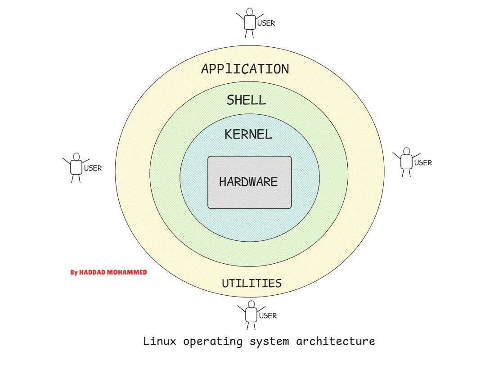

# Week 1 Exercice 3

**By HADDAD MOHAMMED**

The Linux architecture can be depicted as a layered structure. Starting from the bottom, these layers are hardware, kernel, shell, and applications.

Step By Step Explanations : 

The Hardware Layer 

The Kernel Layer (the linux have pricipaly a monolothic Kernel architecture)

The Shell Layer : 

The Last Layer wich is the TopMost Layer the Apllication Layer : 

This is a use case to Well Understande a basic Use case for the Layers interactions

In Conclusion Why Knowing All thees Details ???

