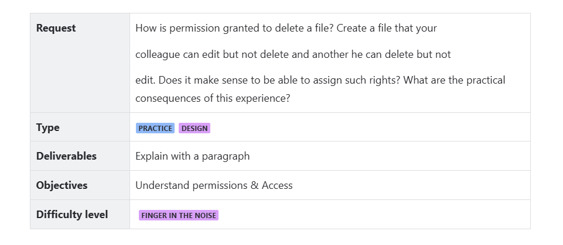

# Exercice 1 Day 1

By Haddad Mohammed



1- The permissionn granted to delete a file its by adding the w (write) permission to it or to give the parent Directory the permision tp write on its content

To create a file that my colleague can edit but not delete:

First, to ensure that the file is not deletable but remains editable, create a folder without write permission (to avoid deletion of the files):

```bash
mkdir -m 755 MyDirectory
```

Use `ls -lh` to display the permissions.

Then, create the file that your colleague can edit but not delete using `touch` and change its permissions with `chmod`:

```bash

touch MyDirectory/fileEditNotdelete
chmod 766 MyDirectory/fileEditNotdelete
```


Now the opposite of what we did previously : 

To create a file that my colleague can delete but not edit:

First, create a folder with write permissions so we ensure that my colleage have the write to edit the content in the Directory  its means delete the files under this Directory : 

```bash
mkdir -m 777 MyDirectory2
```

Use `ls -lh` to display the permissions.

Then, create the file and set its permissions :

```bash
touch MySharedDirectory/fileDeleteNotEdit
chmod 755 MySharedDirectory/fileDeleteNotEdit
```


**Does it make sense to be able to assign such rights?**

It really makes sense because we often face scenarios where assigning such rights is necessary to protect our data from being mishandled by others.

**What are the practical consequences of this experience?**

Sometimes, conflicts between permissions can occur, which can affect very important data. As a result, the data might be deleted or edited by the wrong people.