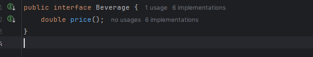

# Exercice 4 Day 1 Week 2:

**Exercise 5 (45 min): Practice OO concepts**

**The Beverages Prices Refactoring kata: a kata to practice refactoring away from an awful application of inheritance.**

This exercise challenges to refactor a beverage pricing application that currently relies on an extensive inheritance hierarchy. 

The original design creates separate classes for every combination of beverage and supplement (e.g., Coffee, CoffeeWithMilk, CoffeeWithMilkAndCream, etc.). 

This approach leads to a proliferation of classes, making the code difficult to maintain and extend. The main objective is to refactor the code so that you can easily add new features—like an optional cinnamon supplement—without having to create a new class for every possible combination.

### Objectives and Learning Outcomes

1. **Refactoring from Inheritance to Composition:**
    
    The exercise demonstrates why overusing inheritance can lead to code that is rigid and hard to scale. You will learn to apply the principle of composition over inheritance, which allows you to mix and match behavior more flexibly.
    
2. **Applying the Decorator Pattern:**
    
    A key design pattern to learn here is the Decorator Pattern. This pattern lets you dynamically add responsibilities (in this case, price adjustments) to objects. Instead of subclassing, you “decorate” a beverage with one or more supplements.
    
3. **Open-Closed Principle:**
    
    By refactoring the design, you practice adhering to the Open-Closed Principle. Your code will be open for extension (you can add new supplements) without requiring modification to existing classes.
    
4. **Clean and Maintainable Code:**
    
    You will gain experience in writing code that is easier to understand, test, and maintain. The exercise emphasizes writing modular, decoupled code, which is essential for scalable software development.
    
5. **Testing-Driven Development (TDD):**
    
    The provided unit tests help ensure that your refactoring does not change the intended behavior. They serve as a safety net that confirms your new design is functionally equivalent to the original.
    
    ### How do i  Approached the Problem
    
    1. **Analyzed the Existing Design**
    2. **Identified the Responsibilities**
        - **Base Beverage:** Each beverage (like Coffee, Tea, Hot Chocolate) has a base price.
        - **Supplements:** Each supplement (such as Milk, Cream, and the new Cinnamon) added fixed amount to the beverage’s price.
    3. **Designed a New Structure Using Composition:**
        
        Created a common interface (or abstract class) for beverages with a `price()` method. Implement the concrete beverage classes for their base prices. Then, design supplement classes that “wrap” a beverage and added their specific cost. This is where the Decorator Pattern comes into play.
        
    4. **Step-by-Step Refactoring:**
        - **Step 1:** I defined a `Beverage` interface with a `price()` method.
        - 
        
        
        
        - **Step 2:** I implemented the base beverage classes, such as `Coffee`, `Tea`, and `HotChocolate`.
        
        
        
        
        
        
        
        - **Step 3:** I created an abstract `Supplement` decorator that implements the `Beverage` interface and holds a reference to a `Beverage` instance.
        
        
        
        - **Step 4:** I implemented concrete supplement decorators like `Milk`, `Cream`
        
        
        
        
        
        - **Step 5:** I composed beverages with supplements dynamically by wrapping a `Coffee` with `Milk`, then with `Cream`, allowing for flexible customization.
    
    
    
    
    
    
    

If i want to add a new supplement easly i add a new class called **Chiba**

