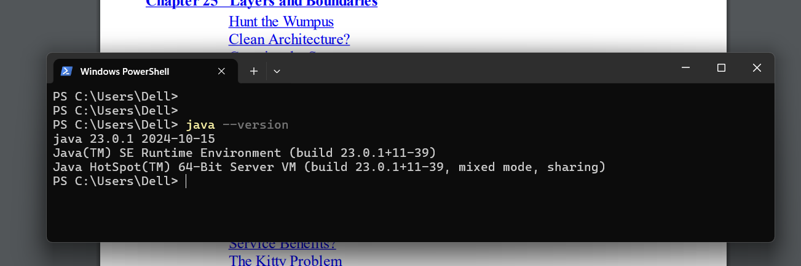

# Week 2 Day 1

**Exercice 1 Day 1 :** 

i had already installed Java in my windows computer 

just by runnning the commande 

```powershell
PS C:\Users\Dell> java —version
```

 i should see the version of the java installed in my computer 



**Exercice 3 Day 1 :**  

installing the Intelijj IDE 

Creating our fisrt empty project piscine-oo  : 


Now lets create a new Java Class : 


here our class are created: 


now by writing the code of the main function : 


and here is the output printed out in the screen :