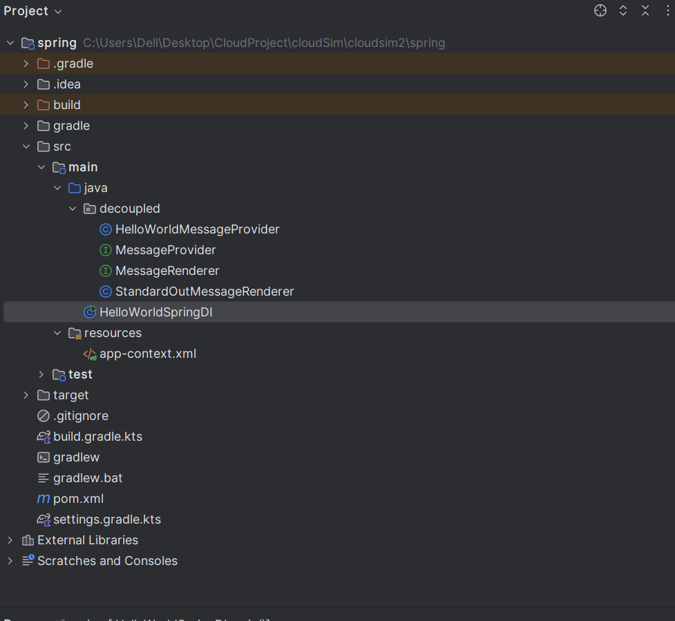

# Ex 1 Day 3

### **The Problem I Am Solving**

In traditional Java applications, dependencies between classes are often tightly coupled. For example, if I need an instance of a class, I typically create it directly using the `new` keyword. While this approach works for small applications, it becomes problematic as the application grows. Tight coupling makes the code rigid, hard to test, and difficult to modify. If I want to change the implementation of a class, I often need to modify multiple parts of the codebase.

For instance, in a simple "Hello World" application:

java

Copy

```java
public class HelloWorld {
    public static void main(String[] args) {
        System.out.println("Hello World!");
    }
}
```

- The message (`"Hello World!"`) is hardcoded.
- If I want to change the message or the way it is rendered (e.g., to a file or a GUI), I need to modify the code directly.

This approach lacks flexibility and violates the **Open/Closed Principle** (one of the SOLID principles), which states that software entities should be open for extension but closed for modification.

---

### **Why I Am Doing This Exercise**

I am practicing this exercise to learn and apply the core concepts of the **Spring Framework**, specifically **Inversion of Control (IoC)** and **Dependency Injection (DI)**. These concepts help me build applications that are modular, maintainable, and easy to test.

### **Key Goals of This Exercise**

1. **Understand Inversion of Control (IoC)**:
    - Instead of creating objects manually, I let Spring manage object creation and dependencies.
    - This shifts the responsibility of object creation from my code to the Spring container.
2. **Practice Dependency Injection (DI)**:
    - I inject dependencies into classes rather than creating them internally.
    - This makes my code more modular and easier to test.
3. **Achieve Loose Coupling**:
    - By using interfaces and dependency injection, I decouple the implementation of components.
    - For example, I can switch the message provider or renderer without modifying the main application logic.
4. **Learn Configuration Styles**:
    - I explore different ways to configure Spring:
        - **XML configuration**
        - **Java configuration**
        - **Annotation-based configuration**
5. **Run a Spring Application**:
    - I use `ClassPathXmlApplicationContext` for XML configuration.
    - I use `AnnotationConfigApplicationContext` for Java and annotation-based configuration.

---

### **What I Will Learn**

By completing this exercise, I will:

1. **Understand Spring Basics**:
    - How Spring manages beans and dependencies.
    - The role of the `ApplicationContext`.
2. **Write Modular Code**:
    - Use interfaces to decouple components.
    - Swap implementations without modifying the main application.
3. **Configure Spring**:
    - Define beans in XML, Java, and annotations.
    - Understand the differences between these approaches.
4. **Run a Spring Application**:
    - Use `ClassPathXmlApplicationContext` for XML configuration.
    - Use `AnnotationConfigApplicationContext` for Java and annotation-based configuration.



### **2. Maven Configuration (`pom.xml`)**

This file defines the project dependencies and build configuration.

**`pom.xml`**

```java
<project xmlns="http://maven.apache.org/POM/4.0.0"
         xmlns:xsi="http://www.w3.org/2001/XMLSchema-instance"
         xsi:schemaLocation="http://maven.apache.org/POM/4.0.0
                             http://maven.apache.org/xsd/maven-4.0.0.xsd">
    <modelVersion>4.0.0</modelVersion>

    <groupId>com.example</groupId>
    <artifactId>spring</artifactId>
    <version>1.0-SNAPSHOT</version>

    <dependencies>
        <!-- Spring Context -->
        <dependency>
            <groupId>org.springframework</groupId>
            <artifactId>spring-context</artifactId>
            <version>5.3.27</version>
        </dependency>

        <!-- Optional: Spring Beans (if needed) -->
        <dependency>
            <groupId>org.springframework</groupId>
            <artifactId>spring-beans</artifactId>
            <version>5.3.27</version>
        </dependency>

        <!-- Optional: JUnit Jupiter for testing -->
        <dependency>
            <groupId>org.junit.jupiter</groupId>
            <artifactId>junit-jupiter</artifactId>
            <version>5.10.0</version>
            <scope>test</scope>
        </dependency>
    </dependencies>

    <build>
        <plugins>
            <!-- Maven Compiler Plugin -->
            <plugin>
                <groupId>org.apache.maven.plugins</groupId>
                <artifactId>maven-compiler-plugin</artifactId>
                <version>3.10.1</version>
                <configuration>
                    <source>11</source>
                    <target>11</target>
                </configuration>
            </plugin>
        </plugins>
    </build>
</project>

```

### **3. Core Interfaces and Classes**

### **Step 1: Interfaces Definitions**

These are the core interfaces for the application.

**`MessageProvider.java`**


**`MessageRenderer.java`**


### **Step 2: Implementation of Interfaces**

These are the concrete implementations of the interfaces.

**`HelloWorldMessageProvider.java`**


### **Step 3: Run the Application**

---

### **Summary of Files**

| **File** | **Purpose** |
| --- | --- |
| `pom.xml` | Maven configuration file with dependencies and build settings. |
| `MessageProvider.java` | Interface for message providers. |
| `MessageRenderer.java` | Interface for message renderers. |
| `HelloWorldMessageProvider.java` | Implementation of `MessageProvider`. |
| `StandardOutMessageRenderer.java` | Implementation of `MessageRenderer`. |
| `app-context.xml` | XML configuration for Spring beans. |
| `HelloWorldSpringDI.java` | Main class for XML-based configuration. |
| `HelloWorldConfiguration.java` | Java configuration class for Spring beans. |
| `HelloWorldSpringAnnotated.java` | Main class for Java and annotation-based configuration. |

The run of the aplication 

### 

