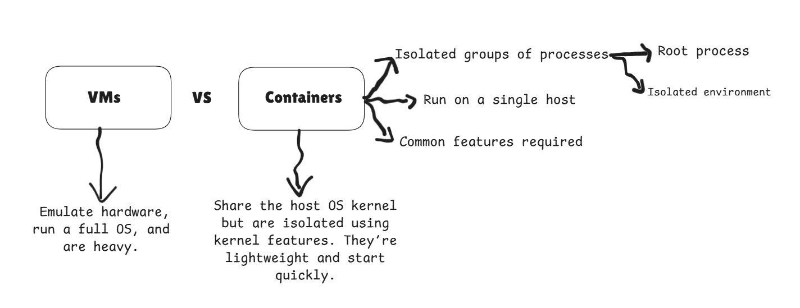

# WEEK 3 : Containers, Kubernetes & IT Security

# **Day 1 ex 1**



### 2. **chroot: The First Step to Isolation**

- **What it does**: Changes the root directory (`/`) for a process and its children. Think of it as giving a process a "jail" with its own filesystem.


- **Limitations**: Not secure alone. A root user can escape it. Example:

# Create a minimal filesystem

```bash
mkdir /mycontainer && cd /mycontainer
cp -r /bin /lib ./  # Copy basic binaries/libs
sudo chroot /mycontainer  # "Jail" into this directory
```

- **Modern replacement :**

```bash
pivot_root
```

for better filesystem isolation.


**Namespaces** are a Linux kernel feature that isolates system resources so processes in different namespaces have separate "views" of those resources. Think of them as virtual compartments that keep processes from interfering with each other or the host system. Here's a breakdown:

**Isolation**: Each namespace isolates specific resources (e.g., filesystems, hostnames, PIDs).

- **Types**: There are **7 namespaces**:
    - **mnt**: Filesystem mounts
    - **pid**: Process IDs
    - **net**: Network interfaces
    - **ipc**: Inter-process communication (shared memory, message queues)
    - **uts**: Hostname and domain name
    - **user**: User/group IDs
    - **cgroup**: Control group views

### **2. How Namespaces Work**

- **API System Calls**:
    - **`clone()`**: Create a new process in new namespaces (e.g., `clone(CLONE_NEWPID)` creates a PID namespace).
    - **`unshare()`**: Move the current process into new namespaces.
    - **`setns()`**: Join an existing namespace (via file descriptors in `/proc/$PID/ns`).
- **`/proc/$PID/ns`**: Virtual files representing a process’s namespaces (e.g., `/proc/self/ns/net` shows the network namespace).

---

### **3. Namespace Types in Action**

### **a. Mount (`mnt`) Namespace**

- **Isolates**: Filesystem mounts.
- **Use Case**: Containers have their own `/proc`, `/sys`, etc.
- **Example**:
    
    ```bash
    sudo unshare -m  # Create a new mount namespace
    mount -t tmpfs tmpfs /mnt  # Mount a tmpfs (visible only in this namespace)
    ```
    
    - The host’s filesystem remains unchanged.

### **b. UTS Namespace**

- **Isolates**: Hostname and domain name.
- **Use Case**: Containers have unique hostnames.
- **Example**:
    
    ```bash
    sudo unshare -u  # New UTS namespace
    hostname my-container  # Set hostname (isolated from host)
    ```
    

### **c. IPC Namespace**

- **Isolates**: Shared memory, message queues.
- **Use Case**: Prevent processes in different containers from interfering via IPC.
- **Example**:
    
    ```bash
    sudo unshare -i  # New IPC namespace
    ipcmk -Q        # Create a message queue (isolated)
    ```
    

### **d. PID Namespace**

- **Isolates**: Process IDs. Processes start at PID 1 inside the namespace.
- **Example**:
    
    ```bash
    sudo unshare -fp --mount-proc
    ps aux  # Shows only processes in the new namespace
    ```
    

### **e. User Namespace**

- **Isolates**: User/group IDs. A process can be "root" inside the namespace but non-root on the host.
- **Example**:
    
    ```bash
    unshare -U  # New user namespace
    whoami      # Shows "nobody" (mapped to host’s non-root user)
    ```
    

### **f. Network (`net`) Namespace**

- **Isolates**: Network interfaces, IPs, routing tables.
- **Example**:
    
    ```bash
    sudo ip netns add mynet  # Create a network namespace
    sudo ip netns exec mynet ip link show  # Isolated interfaces
    ```
    

### **g. Cgroup Namespace**

- **Isolates**: Control group (`cgroup`) hierarchy. Hides host’s cgroup structure from containers.

Creating some natwork interfaces 

the two namspaces are isolated in the host machine 


Now lets make the two namespaces know each others :


### **cgroups (Control Groups)**

**Les cgroups** sont une fonctionnalité du noyau Linux permettant de limiter, prioriser et isoler les ressources (CPU, mémoire, réseau, etc.) des processus.

- **Hiérarchie** : Organise les processus en groupes hiérarchiques sous `/sys/fs/cgroup/`.
- **Utilisation** :
    - **Automatique** : Utilisé par **systemd** pour gérer services et unités.
    - **Manuelle** : Gestion possible en créant/supprimant des répertoires dans `/sys/fs/cgroup/`.
- **Rôle des contrôleurs** : Appliquent des restrictions et allouent les ressources système aux cgroups.
- **Avantages** : Meilleure répartition des ressources, plus d’efficacité, stabilité et sécurité accrues.

### **cgroups v1 vs. cgroups v2**

✅ **cgroups v1** :

- Hiérarchie distincte par ressource (CPU, mémoire, E/S, etc.).
- Possibilité de combiner différentes hiérarchies mais coordination limitée.
- Développement progressif → Incohérences dans la gestion et les fichiers de contrôle.

✅ **cgroups v2** :

- **Hiérarchie unique** pour tous les contrôleurs de ressources.
- Meilleure coordination des ressources.
- Uniformisation des fichiers de contrôle et du comportement des contrôleurs.