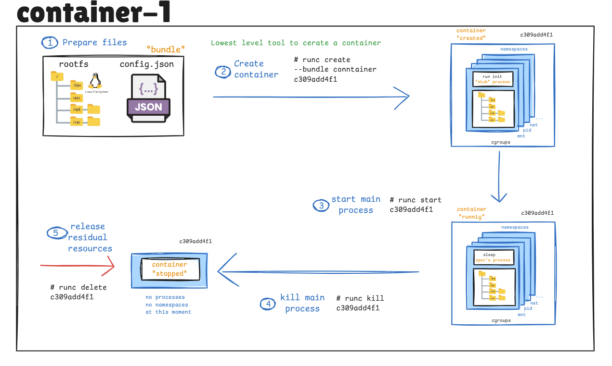

# Exercice 1 Week 3

Creating containers with the runc command : 




**Part 1: Docker Runtime Exploration**

First i need to install the docker in my VM ubunto : 

1. **Updating my Existing Package List**

```bash
sudo apt-get update
```

This ensures that all packages list is up-to-date.

2. **Installing the  Required Packages**

Install packages that let apt use repositories over HTTPS

Install packages that let apt use repositories over HTTPS:

```bash
sudo apt-get install apt-transport-https ca-certificates curl gnupg lsb-release
```

---

3. **Add Docker’s Official GPG Key**

Download and add Docker’s GPG key to verify the authenticity of the Docker packages:

```bash
curl -fsSL https://download.docker.com/linux/ubuntu/gpg | sudo gpg --dearmor -o /usr/share/keyrings/docker-archive-keyring.gpg

```


6. **Install Docker Engine and Related Packages**

Now, install Docker Engine, Docker CLI, containerd, and the Docker Compose plugin:

```bash
sudo apt-get install docker-ce -y 
```


7. **Start the Docker Service**

Once installed, start the Docker service with:

Once installed, start the Docker service with:

```bash
sudo systemctl start docker
```

To enable Docker to start at boot, run:

```bash
sudo systemctl enable docker
```

Then check Docker: 

```bash
sudo systemctl status docker
```


**PODMAN** 

after the install : 


