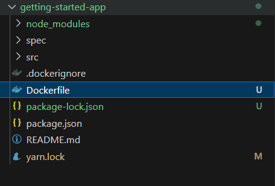

# Exercice 3 Week 3

DOCKER : 

## **Containerize an application**

i cloned a getting-started project to use docker : 

i created a docker file : 

i builded the project : 

and i run it on port 3000 on my machine :

## **Update the application**

Now time to change the code : 

i updated the code in the app.js

i build the app again: 

i tried to run it but i got an erorr ; 

so i figured out that i need to kill the previous run 

so i stop it first then remove it : 

then run it again and its worked successfuly : 

here is the updated interface : 

Now time to share it into public : 

i tried to push it :

but i got an error 

Why did it fail? The push command was looking for an image named `docker/getting-started`, but didn't find one. If you run `docker image ls`, you won't see one either.

first i loged in into my doker hub in my terminal 

and then Tag it using the docker tag command 

Now when i list the images  i can see : 

ill use Play with docker : 

Play with Docker uses the amd64 platform. If you are using an ARM based Mac with Apple silicon, you will need to rebuild the image to be compatible with Play with Docker and push the new image to your repository.

To build an image for the amd64 platform, use the `--platform` flag.

# **Persist the DB**

Now let try to solve the problem of when we creat/update/delete in the filesys of the each container and remove it after the modification dosnt persist so all our modifications un a specific file of path are lost 

the solustion is the Volumes , types of vollumes are  : 

- **bind mounts :** Bind mounts map a directory or file on the host system to a directory or file within the container. This
- **named volumes :** Docker creates and manages named volumes, which provide a convenient way to persist data across container restarts and removals. Named volumes are more portable than bind mounts and can be easily shared between containers.
- **anonymous volumes :** Anonymous volumes are similar to named volumes in that they are not given a name. When a container is started without specifying a volume name or bind mount, they are created automatically.

## [**Quick volume type comparisons**](https://docs.docker.com/get-started/workshop/06_bind_mounts/#quick-volume-type-comparisons)

The following are examples of a named volume and a bind mount using `--mount`:

- Named volume: `type=volume,src=my-volume,target=/usr/local/data`
- Bind mount: `type=bind,src=/path/to/data,target=/usr/local/data`

The following table outlines the main differences between volume mounts and bind mounts.

|  | **Named volumes** | **Bind mounts** |
| --- | --- | --- |
| Host location | Docker chooses | You decide |
| Populates new volume with container contents | Yes | No |
| Supports Volume Drivers | Yes | No |

ill try the mount volume : 

here i tested without using any volume i tested if the data are persisted 

but no data persisted 

icreated the volume first : 

i runed the cont using docker run and specifiying the —mount , the type and the path target and the src as folows 

easly i inspected the volume : 

after runnig and stoping , removing and runnimg again the data persisted successfuly : 

The Bind mounts Volume practice : 

first i runed an Ubunto bash container 

using the  --mount type=bind,src="$(pwd)",target=/src 

the "$(pwd)" indicate to use the current directorry wich is the getting-started directory as a src means the directory to bind with the container 

and the target indicate the /src in the Ubunto container 

using the -it to enter the bash 

i cd the /src and touch a file named bind-mount-test.test

and when i checked the host i find out that the same file created in the getting-startes directory 

and tried deleting it in the host and its deleted from the container also : 

### Now we will try Multiple Containers :

first i created a network called todo-app : 

i created a container for the Mysql DB : 

i have connected to it sucessfuly : 

then using the nicolaka/netshoot image i created a container to test the Mysql container network 

then i runed my app container : 

i tested the app : 

and successfully the data aded in the database

Now Getting familiar with the docker compose  : 

i created the compose.yaml

and using the command : docker compose up -d

i got an error of  "Host '192.168.0.3' is not allowed to connect to this MySQL to connect