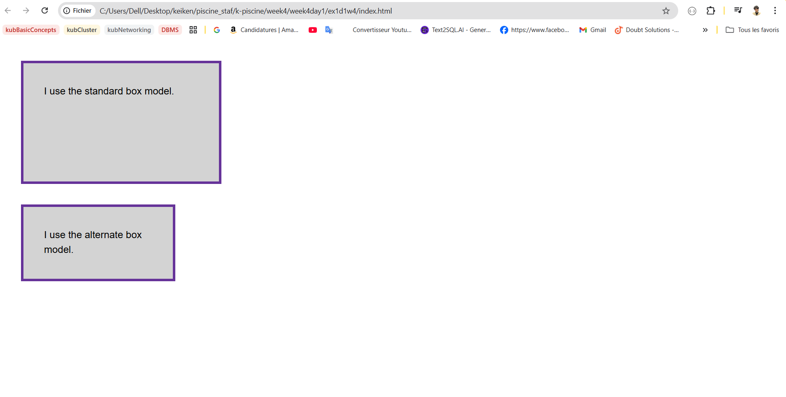

# WEEK 4 : Web Developement : Frontend & Devops/Agile & Orga

# Day 1

### **Block vs. Inline Boxes**

- **Block Boxes** (`display: block`):
    - Start on a new line; take full container width by default.
    - Respect `width`, `height`, and all margins/paddings.
    - Examples: `<div>`, `<p>`, `<h1>`.
- **Inline Boxes** (`display: inline`):
    - Flow within text/content; no line breaks.
    - Ignore `width`/`height`; top/bottom margins/paddings **do not** affect layout (left/right do).
    - Examples: `<span>`, `<a>`, `<em>`.

### **Display Types**

- **Outer Display Type**: Determines box's interaction with surrounding elements (block/inline).
- **Inner Display Type**: Controls layout of child elements (e.g., `flex`, `grid`).
    - Example: `display: flex` sets outer type to `block` and inner to `flex`.

### **CSS Box Model**

- **Standard Box Model**:
    - `width`/`height` define content size; padding/border **add** to total dimensions.
    - Total width = `width` + `padding` + `border`.
- **Alternative Box Model** (`box-sizing: border-box`):
    - `width`/`height` include content, padding, and border.
    - Preferred for easier sizing; often applied globally:
        
        ```css
        html { box-sizing: border-box; }
        *, *::before, *::after { box-sizing: inherit; }
        ```
        

### **Box Model Components**

1. **Content**: Core area for text/images (set by `width`/`height`).
2. **Padding**: Space between content and border (`padding` shorthand).
3. **Border**: Line around padding (`border`, `border-top`, etc.).
4. **Margin**: Outer space pushing elements away (`margin` shorthand).
    - **Margin Collapsing**:
        - Adjacent vertical margins collapse to the larger value.
        - Mixed positive/negative margins subtract.

### **Inline vs. Inline-Block**

- **Inline Elements**:
    - Ignore `width`/`height`; vertical padding/margin overlap other content.
- **Inline-Block** (`display: inline-block`):
    - Hybrid: Flows inline but respects `width`/`height` and margins (e.g., for clickable links with padding).

## TASK 1:

In this task, there are two boxes below, one is using the standard box model, the other the alternate box model. Change the width of the second box by adding declarations to the `.alternate` class, so that it matches the visual width of the first box.

 

the Html 

```html
<!DOCTYPE html>
<html lang="en">
  <head>
    <meta charset="UTF-8" />
    <meta name="viewport" content="width=device-width, initial-scale=1.0" />
    <title>Document</title>
    <!-- style.css -->
    <link rel="stylesheet" href="style.css" />
  </head>
  <body>
    <div class="box">I use the standard box model.</div>
    <div class="box alternate">I use the alternate box model.</div>
  </body>
</html>

```

the css 

```css
body {
    font: 1.2em / 1.5 sans-serif;
  }
  .box {
    border: 5px solid rebeccapurple;
    background-color: lightgray;
    padding: 40px;
    margin: 40px;
    width: 300px;
    height: 150px;
  }
  
  .alternate {
    box-sizing: border-box;
  }
  
```



the Solution : 

```css
body {
    font: 1.2em / 1.5 sans-serif;
  }
  .box {
    border: 5px solid rebeccapurple;
    background-color: lightgray;
    padding: 40px;
    margin: 40px;
    width: 300px;
    height: 150px;
  }
  
  .alternate {
    box-sizing: border-box;
    width: 390px;
  }
  
```


**Standard Box Model:**

Total element size = defined width + padding (left + right)+ border (left + right) .

**Alternate Box Model:**

Defined width

*includes*

content, padding, and border (total size matches the specified width).


## TASK 2 :

In this task, add the following things to the box:

- A 5px, black, dotted border.
- A top margin of 20px.
- A right margin of 1em.
- A bottom margin of 40px.
- A left margin of 2em.
- Padding on all sides of 1em.


the Solution : 

```css
body {
  font: 1.2em / 1.5 sans-serif;
}

.box {
  margin: 20px 1em 40px 2em;
  padding: 1em;
  border: 5px dotted black;
  
}
```


## TASK 3:

In this task, the inline element has a margin, padding and border. However, the lines above and below are overlapping it. What can you add to your CSS to cause the size of the margin, padding, and border to be respected by the other lines, while still keeping the element inline?


i added `display: inline-block`


the code will be in the same root folder inside task1 task2 task3 folders