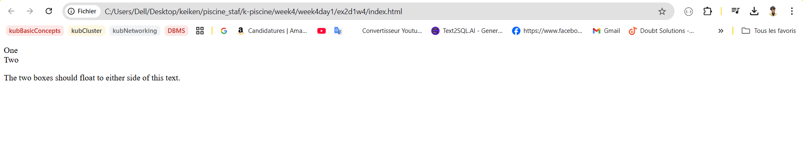

# WEEK 4 : Web Developement : Frontend & Devops/Agile & Orga

# Day 1

### Float

### **Key Concepts**

- **Original Purpose**: Float images/text within content (e.g., text wrapping around images, drop caps).
- **Legacy Use**: Historically used for multi-column layouts (now replaced by **Flexbox** and **Grid**).

### **Float Basics**

- **`float` Property**:
    - Values: `left`, `right`, `none` (default).
    - Removes element from **normal flow**, shifts it to the specified side.
    - Surrounding content **wraps** around the float.
- **`clear` Property**:
    - Values: `left`, `right`, `both`.
    - Prevents elements from wrapping around floats (e.g., `clear: left` stops content from flowing past a left float).

### **Clearing Floats**

- **Problem**: Floated elements can cause parent containers to collapse (backgrounds/borders don’t wrap floated content).
- **Solutions**:
    1. **`clear`**: Apply `clear: both` to an element after the float.
    2. **`display: flow-root`**: Modern method – forces parent to contain floats without extra markup.
    
    ```css
    .wrapper { display: flow-root; }
    ```
    

## TASK 1 :

In this task, you need to float the two elements with a class of `float1` and `float2` left and right, respectively. The text should then appear between the two boxes, as in the image below:

```html
<!DOCTYPE html>
<html lang="en">
<head>
    <meta charset="UTF-8">
    <meta name="viewport" content="width=device-width, initial-scale=1.0">
    <title>Document</title>
    <link rel="stylesheet" href="style.css" />
</head>
<body>
    <div class="box">
        <div class="float float1">One</div>
        <div class="float float2">Two</div>
        <p>The two boxes should float to either side of this text.</p>
      </div>
      
</body>
</html>
```

```css

.float1 {

}

.float2 {
}

```



the Solution is 

```css
 
 body {
    font: 1.2em / 1.5 sans-serif;
  }
  
  .float {
    margin: 20px 1em 40px 2em;
    padding: 1em;
    border: 5px solid  black;
    
  }
  
  
.float1 {
    float: right;
}

.float2 {
    float: left;
}

```


## TASK 2 :

In this task, the element with a class of `float` should be floated left. Then we want the first line of text to display next to that element, but the following line of text (which has a class of `below`) to display underneath it.


the solution is : 

```css

  
  .float {

    border: 5px solid black;
    float: left;

  }
  
  .below {
    clear: left;
  }
  
```


## TASK 3 :

In this task, we have a floated element. The box wrapping the float and text is displaying behind the float. Use the most up-to-date method available to cause the box background to extend to below the float


the solustion is: 

**`display: flow-root`**: Modern method – forces parent to contain floats without extra markup.


### **Positioning Types**

1. **Static** (`position: static`):
    - **Default** behavior; element remains in normal document flow.
    - Ignores `top`, `bottom`, `left`, `right`.
2. **Relative** (`position: relative`):
    - Stays in normal flow but **adjustable** via `top`, `left`, etc.
    - Offsets are relative to its **original position**.
    - Creates a **positioning context** for absolutely positioned children.
3. **Absolute** (`position: absolute`):
    - Removed from normal flow; positioned relative to the **nearest positioned ancestor** (non-`static`).
    - Uses `top`, `left`, etc., to set distance from ancestor’s edges.
    - If no positioned ancestor, uses the **viewport** (initial containing block).
4. **Fixed** (`position: fixed`):
    - Removed from normal flow; positioned relative to the **viewport**.
    - Stays in place during scrolling (e.g., fixed navigation bars).
5. **Sticky** (`position: sticky`):
    - Hybrid: Acts as `relative` until scrolled past a threshold (e.g., `top: 30px`), then becomes `fixed`.
    - Sticks within its **nearest scrolling ancestor** (e.g., a scrollable container).