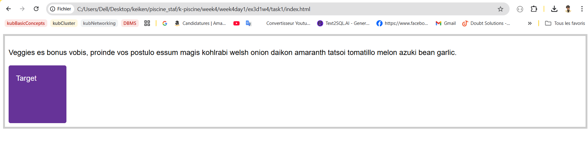

# WEEK 4 : Web Developement : Frontend & Devops/Agile & Orga

# Day 1

### **Positioning Types**

1. **Static** (`position: static`):
    - **Default** behavior; element remains in normal document flow.
    - Ignores `top`, `bottom`, `left`, `right`.
2. **Relative** (`position: relative`):
    - Stays in normal flow but **adjustable** via `top`, `left`, etc.
    - Offsets are relative to its **original position**.
    - Creates a **positioning context** for absolutely positioned children.
3. **Absolute** (`position: absolute`):
    - Removed from normal flow; positioned relative to the **nearest positioned ancestor** (non-`static`).
    - Uses `top`, `left`, etc., to set distance from ancestor’s edges.
    - If no positioned ancestor, uses the **viewport** (initial containing block).
4. **Fixed** (`position: fixed`):
    - Removed from normal flow; positioned relative to the **viewport**.
    - Stays in place during scrolling (e.g., fixed navigation bars).
5. **Sticky** (`position: sticky`):
    - Hybrid: Acts as `relative` until scrolled past a threshold (e.g., `top: 30px`), then becomes `fixed`.
    - Sticks within its **nearest scrolling ancestor** (e.g., a scrollable container).

## TASK 1

In this task, we want you to position the item with a class of `target` to the top and right of the container, which has the 5px grey border.



```css
body {
  font: 1.2em / 1.5 sans-serif;
}
* {
  box-sizing: border-box;
}

.container {
  padding: 0.5em;
  border: 5px solid #ccc;
}

.target {
  width: 150px;
  height: 150px;
  border-radius: 5px;
  background-color: #663398;
  padding: 1em;
  color: white;
}
.container {
  position: relative;
  display: flow-root;

}

.target {
  position: absolute;
  top :0;
  right: 0;
}

```


## TASK 2 :

In this task, if you scroll the box in the example below, the sidebar scrolls with the content. Change it so that the sidebar (`<div class="sidebar">`) stays in place and only the content scrolls.


Just by adding the position fixed to the sidbar we solve the problem : 

```css
.sidebar {
  position: fixed;
}

```

